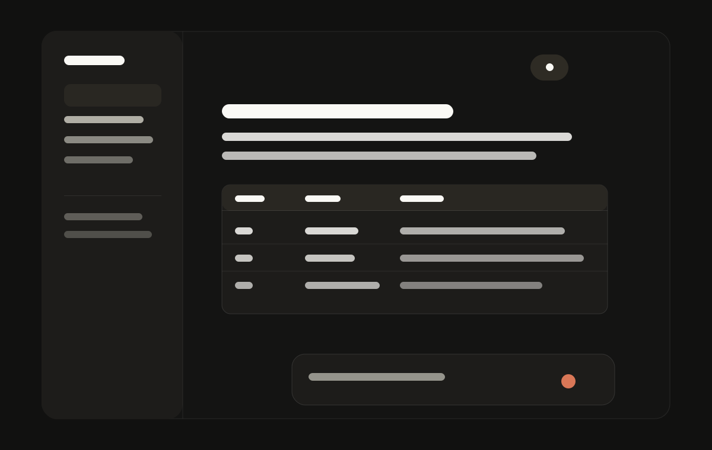
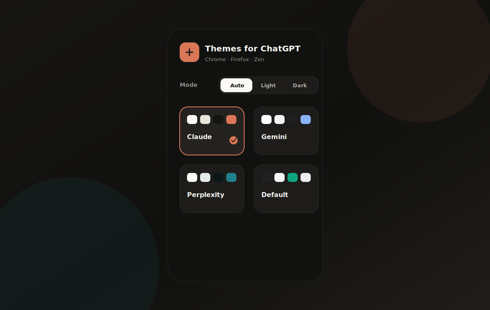

# Themes for ChatGPT

A Chrome, Firefox, and Zen extension that gives ChatGPT Claude, Gemini, and Perplexity-style themes.

<p align="center">
  
</p>

## What it does

- Adds Claude, Gemini, and Perplexity-inspired themes.
- Follows ChatGPT's light or dark mode automatically.
- Lets you force Auto, Light, or Dark from the popup.
- Keeps the native ChatGPT theme available as the default option.
- Themes common ChatGPT UI: messages, composer, menus, settings, tables, files, reports, and sidebars.

## Install locally

Download the latest package from the [releases page](https://github.com/jasperdevs/themes-for-chatgpt/releases/latest), or load the repo folder directly while developing.

### Chrome, Edge, Brave

1. Open `chrome://extensions`.
2. Enable `Developer mode`.
3. Click `Load unpacked`.
4. Select this repository folder.

### Firefox / Zen

1. Open `about:debugging#/runtime/this-firefox`.
2. Click `Load Temporary Add-on`.
3. Select `manifest.json`.

## Themes

<p align="center">
  
</p>

The popup includes a theme picker and a mode switcher. `Auto` follows the current ChatGPT appearance. `Light` and `Dark` force the selected mode.

## What it handles

<p align="center">
  
</p>

The CSS covers the parts of ChatGPT that usually break when recolored: the message composer, model menus, settings toggles, report cards, library rows, generated images, tables, tooltips, sidebars, and message actions.

## Development

Install dependencies:

```bash
npm install
```

Run the extension locally:

```bash
npm run dev
```

Run the full check before publishing:

```bash
npm run check
```

Scan a real ChatGPT tab from a browser started with remote debugging:

```bash
npm run scan:chatgpt-dom
```

## Permissions

The extension only requests `storage`. It runs on `chatgpt.com` and `chat.openai.com`.

## License

MIT. See [LICENSE](./LICENSE).
