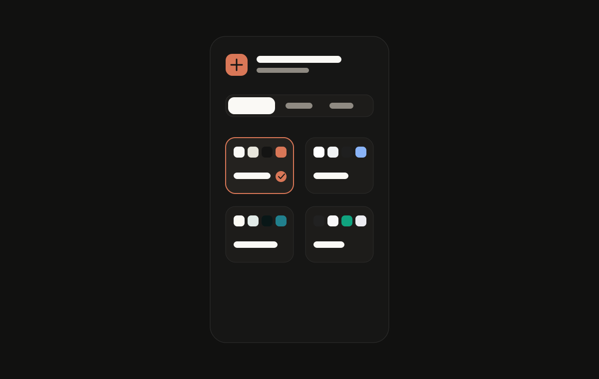

<h1 align="center">Themes for ChatGPT</h1>
<p align="center">A lightweight Chrome, Firefox, and Zen extension for Claude, Gemini, and Perplexity-style ChatGPT themes.</p>

<p align="center">
  <a href="https://github.com/jasperdevs/themes-for-chatgpt/stargazers">
    
  </a>
  <a href="https://github.com/jasperdevs/themes-for-chatgpt/releases">
    
  </a>
  <a href="https://github.com/jasperdevs/themes-for-chatgpt/blob/main/LICENSE">
    
  </a>
  <a href="https://github.com/jasperdevs/themes-for-chatgpt/releases/latest">
    
  </a>
</p>

<h2 align="center">Install</h2>

<p align="center">
  <a href="https://github.com/jasperdevs/themes-for-chatgpt/releases/latest">Download the packaged release files</a>
</p>

<table align="center">
<tr>
<td width="50%" valign="top" align="center">
<h3> Chrome</h3>
<p>1. Open <code>chrome://extensions</code></p>
<p>2. Enable <code>Developer mode</code></p>
<p>3. Click <code>Load unpacked</code></p>
<p>4. Select the repository folder</p>
</td>
<td width="50%" valign="top" align="center">
<h3> Firefox / Zen</h3>
<p>1. Open <code>about:debugging#/runtime/this-firefox</code></p>
<p>2. Click <code>Load Temporary Add-on</code></p>
<p>3. Select <code>manifest.json</code></p>
</td>
</tr>
</table>

<h2 align="center">Features</h2>

<table align="center">
<tr>
<td width="40%" valign="middle">
<h3>Adaptive AI themes</h3>
Switch ChatGPT between Claude, Gemini, and Perplexity-inspired presets while keeping a native default option.
</td>
<td width="60%">

</td>
</tr>
<tr>
<td width="40%" valign="middle">
<h3>Light and dark aware</h3>
Auto mode follows ChatGPT's current appearance, or you can force Light/Dark from the popup.
</td>
<td width="60%">

</td>
</tr>
<tr>
<td width="40%" valign="middle">
<h3>Broad ChatGPT coverage</h3>
Keeps common ChatGPT surfaces readable and usable, including the composer, menus, settings, tables, report cards, library rows, files, tooltips, generated images, and message actions.
</td>
<td width="60%">

</td>
</tr>
</table>

<h2 align="center">Notes</h2>

<p align="center">Uses only the browser <code>storage</code> permission</p>
<p align="center">Runs on <code>chatgpt.com</code> and <code>chat.openai.com</code></p>
<p align="center">Supports Chrome, Firefox, Edge, Brave, and Zen from one MV3 WebExtension codebase</p>
<p align="center">Includes render audits and a live DOM scanner for clipped, invisible, or unthemed ChatGPT surfaces</p>

<h2 align="center">Development</h2>

<p align="center">Install dependencies and run the local dev loop:</p>

```bash
npm install
npm run dev
```

<p align="center">Run the full verification suite:</p>

```bash
npm run check
```

<p align="center">Scan a real logged-in ChatGPT page from a browser started with remote debugging:</p>

```bash
npm run scan:chatgpt-dom
```

<p align="center">
  <a href="https://star-history.com/#jasperdevs/themes-for-chatgpt&Date">
    <picture>
      <source media="(prefers-color-scheme: dark)" srcset="https://api.star-history.com/svg?repos=jasperdevs/themes-for-chatgpt&type=Date&theme=dark" />
      <source media="(prefers-color-scheme: light)" srcset="https://api.star-history.com/svg?repos=jasperdevs/themes-for-chatgpt&type=Date" />
      
    </picture>
  </a>
</p>

<h2 align="center">License</h2>

<p align="center">Themes for ChatGPT is available under the <a href="./LICENSE">MIT License</a>.</p>
